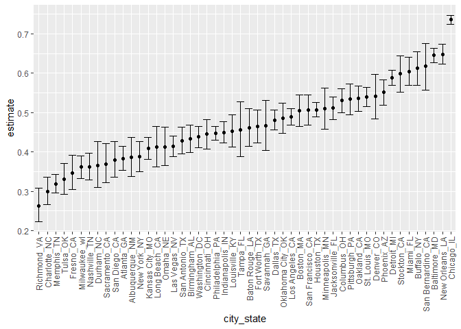
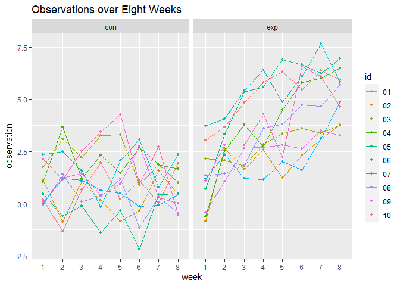
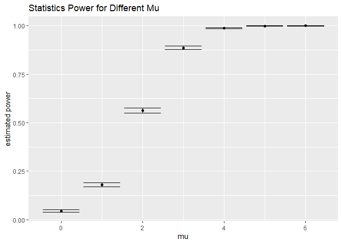
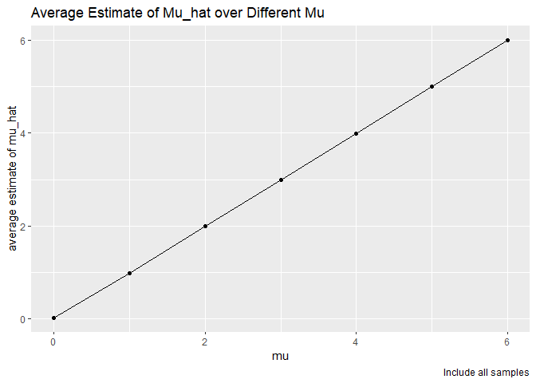
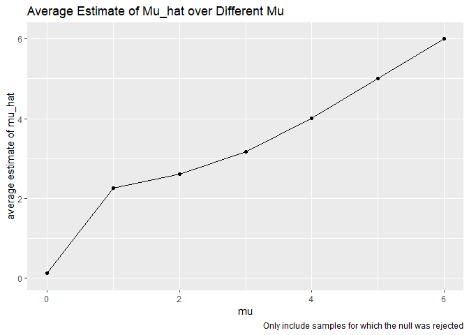

Homework 5
================
Ying Jin
2020/11/14

## Problem 1

Read in the dataset

``` r
url_file = 
  "https://raw.githubusercontent.com/washingtonpost/data-homicides/master/homicide-data.csv"

homicide_df = 
  read_csv(url(url_file)) %>% 
  mutate(
    city_state = str_c(city,state, sep = "_"),
    resolved = case_when(
      disposition == "Closed without arrest" ~ "unsolved",
      disposition == "Open/No arrest" ~ "unsolved",
      disposition == "Closed by arrest" ~ "solved",
    ) 
  ) %>% 
  select(city_state, resolved) %>% 
  filter(city_state != "Tulsa_AL")
```

    ## Parsed with column specification:
    ## cols(
    ##   uid = col_character(),
    ##   reported_date = col_double(),
    ##   victim_last = col_character(),
    ##   victim_first = col_character(),
    ##   victim_race = col_character(),
    ##   victim_age = col_character(),
    ##   victim_sex = col_character(),
    ##   city = col_character(),
    ##   state = col_character(),
    ##   lat = col_double(),
    ##   lon = col_double(),
    ##   disposition = col_character()
    ## )

Let’s looke at this a bit

``` r
aggregate_df =
homicide_df %>% 
  group_by(city_state) %>% 
  summarise(
    hom_total = n(),
    hom_unsolved = sum(resolved == "unsolved")
  )
```

    ## `summarise()` ungrouping output (override with `.groups` argument)

Do a prop test for a single city

``` r
prop.test(
  aggregate_df %>% filter(city_state == "Baltimore_MD") %>% pull(hom_unsolved),
  aggregate_df %>% filter(city_state == "Baltimore_MD") %>% pull(hom_total)
) %>% broom::tidy()
```

    ## # A tibble: 1 x 8
    ##   estimate statistic  p.value parameter conf.low conf.high method    alternative
    ##      <dbl>     <dbl>    <dbl>     <int>    <dbl>     <dbl> <chr>     <chr>      
    ## 1    0.646      239. 6.46e-54         1    0.628     0.663 1-sample~ two.sided

Try to iterate

``` r
results_df = 
  aggregate_df %>% 
  mutate(
    prop_tests = map2(.x = hom_unsolved, .y = hom_total, ~prop.test(x = .x,n = .y)),
    tidy_tests = map(.x = prop_tests, ~broom::tidy(.x))
  ) %>% 
  select(-prop_tests) %>% 
  unnest(tidy_tests) %>% 
  select(city_state, estimate, conf.low, conf.high)
```

Then make a plot

``` r
results_df %>% 
  mutate(
    city_state = fct_reorder(city_state, estimate)
  ) %>% 
  ggplot(aes(x = city_state, y = estimate)) + 
  geom_point() +
  geom_errorbar(aes(ymin = conf.low, ymax = conf.high)) +
  theme(axis.text.x = element_text(angle = 90, vjust = 0.5, hjust = 1))
```

<!-- -->

## Problem 2

``` r
exp_df = tibble(
  name = list.files("./data")
) %>% 
  mutate(
    path = str_c("./data",name, sep = "/"),
    data = map(.x = path, ~read_csv(.x))
  ) %>% 
  unnest(data) %>% 
  mutate(
   name = gsub( ".csv","", name)
  ) %>% 
  separate(name, into = c("arm","id"), sep = "_",remove = TRUE) %>% 
  select(-path) %>% 
  pivot_longer(
    week_1:week_8,
    names_to = "week",
    names_prefix = "week_",
    values_to = "observation"
  )
```

Then make a spaghetti plot showing observations on each subject over
time

``` r
exp_df %>% 
  ggplot(aes(x = week, y = observation, color = id, group = id)) +
  geom_point(size = 1) +
  geom_line() +
  facet_grid(.~arm) +
  labs(
    title = "Observations over Eight Weeks"
  )
```

<!-- -->

From the plot we can see that:

  - Overall, the observation levels are higher in experimental arm than
    control arm;

  - The observations at certain time in experimental arm is more
    disperse than control arm;

  - The observation levels in experimental group increased over time
    while that in control groups basically stayed constant.

## Problem 3

The function to get mu\_hat and p\_value from t.test for a sample from
N(mean ,sd = 5)

``` r
set.seed(5)

sim_mean_p = function(samp_size = 30, mean, sigma = 5)
{
  sim_data = tibble(
    sample = rnorm(n = samp_size, mean = mean, sd = sigma)
  )
  
  sim_data %>% 
    mutate(
      p_value = t.test(sample, mu = 0) %>% broom::tidy() %>%         pull(p.value)
    ) %>% 
    summarise(
      mu_hat = mean(sample),
      p_value = mean(p_value)
    ) 
  
}
```

Set μ as 0 and iterate this function for 5000 times

``` r
 sim_results_zero = 
  rerun(5000, sim_mean_p(mean = 0)) %>% 
  bind_rows()
```

Repeat the above for μ={1,2,3,4,5,6}

``` r
sim_results = 
  tibble(mu = c(1,2,3,4,5,6)) %>% 
  mutate(
    estimate_dfs = map(.x = mu, ~rerun(5000, sim_mean_p(mean = .x)))
    ) %>% 
  unnest(estimate_dfs) %>% 
  unnest(estimate_dfs)
```

add an indicator of whether the null was rejected and count the number
of times the null was rejected

``` r
aggregate_tb = 
  sim_results %>% 
  mutate(
    conclusion = case_when(
      p_value <= 0.05 ~ "rejected",
      p_value > 0.05 ~ "fail to reject"
    )
  ) %>% 
  group_by(mu) %>% 
  summarise(
    total_n = n(),
    rejected_n = sum(conclusion == "rejected")
  )
```

    ## `summarise()` ungrouping output (override with `.groups` argument)

Calculate the proportion of times the null was rejected

``` r
prop_df = 
  aggregate_tb %>% 
  mutate(
    prop_test = map2(.x = rejected_n, .y = total_n, ~prop.test(x = .x, n = .y)),
    prop_tidy = map(.x = prop_test, ~broom::tidy(.x)) 
  ) %>% 
  select(-prop_test) %>% 
  unnest(prop_tidy) %>% 
  select(mu,estimate, conf.low, conf.high)
```

Then make a plot

``` r
prop_df %>% 
  ggplot(aes(x = mu, y = estimate)) +
  geom_point() +
  geom_errorbar(aes(ymin = conf.low, ymax = conf.high)) +
  labs(
    title = "Statistics Power for Different Mu",
    y = "estimated power"
  )
```

<!-- -->

From the plot above we can see that as μ increases, or as the size of
effect increases, the power also increases.

Make a plot showing the average estimate of μ\_hat on the y axis and the
true value of μ on the x axis.

``` r
sim_results %>% 
  group_by(mu) %>% 
  summarise(
    avg_mu_hat = mean(mu_hat)
  ) %>% 
  ggplot(aes(x = mu, y = avg_mu_hat)) +
  geom_point() +
  geom_line() +
  labs(
    title = "Average Estimate of Mu_hat over Different Mu",
    caption = "Include all samples",
    y = "average estimate of mu_hat"
  )
```

    ## `summarise()` ungrouping output (override with `.groups` argument)

<!-- -->

Make a second plot of the average estimate of μ\_hat in samples for
which the null was rejected on the y axis and the true value of μ on the
x axis.

``` r
sim_results %>% 
  filter(p_value <= 0.05) %>% 
   group_by(mu) %>% 
  summarise(
    avg_mu_hat = mean(mu_hat)
  ) %>% 
  ggplot(aes(x = mu, y = avg_mu_hat)) +
  geom_point() +
  geom_line() +
  labs(
    title = "Average Estimate of Mu_hat over Different Mu",
    caption = "Only include samples for which the null was rejected",
    y = "average estimate of mu_hat"
  )
```

    ## `summarise()` ungrouping output (override with `.groups` argument)

<!-- -->

Is the sample average of μ^ across tests for which the null is rejected
approximately equal to the true value of μ? Why or why not?

According to these two plots, we can find that:

  - The sample average of μ\_hat in all samples are approximately equal
    to true μ;

  - While the sample average of μ\_hat across tests for which the null
    is rejected doesn’t approximately equal to the true μ.
